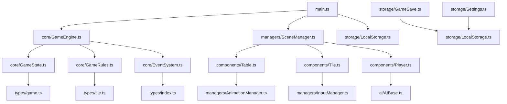

# 麻将游戏从服务器-客户端架构到TypeScript单机游戏重构计划

## 1. 现有项目架构分析

### 1.1 项目结构概览
现有项目是一个基于Three.js的3D麻将游戏，采用服务器-客户端架构。主要文件结构包括：
- `Mahjong.html` - 主HTML入口文件
- `js/` - JavaScript源代码目录
  - `add/` - 游戏功能添加模块
  - `init/` - 初始化模块
  - `Manager/` - 游戏管理器
  - `myUtils/` - 工具函数
  - `rules/` - 游戏规则
- `css/` - 样式文件
- `util/` - 第三方库（Three.js等）

### 1.2 核心依赖关系
- **Three.js** - 3D渲染引擎
- **WebSocket** - 服务器通信（需要移除）
- **Tween.js** - 动画库
- **dat.GUI** - 调试界面

### 1.3 服务器端和客户端职责划分
**服务器端职责（需要本地化）：**
- 游戏状态管理
- 玩家匹配和房间管理
- 游戏规则验证
- 牌局数据存储
- 玩家数据持久化

**客户端职责：**
- 3D场景渲染
- 用户交互处理
- 动画效果展示
- UI界面显示

## 2. 需要本地化的服务器功能

### 2.1 游戏状态管理
- **房间管理**：转换为本地游戏会话管理
- **玩家状态**：转换为本地玩家数据结构
- **牌局状态**：转换为本地游戏状态对象
- **游戏流程控制**：转换为本地游戏控制器

### 2.2 数据存储
- **玩家数据**：使用localStorage或IndexedDB存储
- **游戏记录**：本地存储游戏历史
- **设置配置**：本地存储用户偏好设置

### 2.3 游戏规则验证
- **胡牌判断**：客户端本地验证
- **碰杠吃判断**：客户端本地验证
- **游戏流程控制**：客户端本地控制

### 2.4 AI玩家逻辑
- **简单AI**：实现基本的出牌逻辑
- **中等AI**：实现基本的策略判断
- **高级AI**：实现复杂策略和记忆功能

## 3. TypeScript类型系统和接口定义

### 3.1 核心类型定义

```typescript
// 牌型定义
interface MahjongTile {
  id: string;
  type: 'wan' | 'tong' | 'tiao' | 'feng' | 'jian';
  value: number;
  display: string;
}

// 玩家定义
interface Player {
  id: string;
  name: string;
  isHuman: boolean;
  position: 'east' | 'south' | 'west' | 'north';
  tiles: MahjongTile[];
  discardedTiles: MahjongTile[];
  score: number;
  isCurrentTurn: boolean;
}

// 游戏状态
interface GameState {
  id: string;
  players: Player[];
  currentPlayerIndex: number;
  wall: MahjongTile[];
  discardedTiles: MahjongTile[];
  phase: 'setup' | 'playing' | 'scoring' | 'finished';
  round: number;
  wind: 'east' | 'south' | 'west' | 'north';
  lastAction?: GameAction;
}

// 游戏动作
interface GameAction {
  type: 'draw' | 'discard' | 'chi' | 'peng' | 'gang' | 'hu' | 'pass';
  playerId: string;
  tiles?: MahjongTile[];
  timestamp: Date;
}

// 游戏配置
interface GameConfig {
  aiDifficulty: 'easy' | 'medium' | 'hard';
  gameSpeed: 'slow' | 'normal' | 'fast';
  soundEnabled: boolean;
  musicEnabled: boolean;
  autoSortTiles: boolean;
  showHints: boolean;
}
```

### 3.2 服务接口定义

```typescript
// 本地存储服务
interface LocalStorageService {
  saveGame(gameState: GameState): Promise<void>;
  loadGame(gameId: string): Promise<GameState | null>;
  savePlayerData(playerId: string, data: any): Promise<void>;
  loadPlayerData(playerId: string): Promise<any>;
  saveSettings(settings: GameConfig): Promise<void>;
  loadSettings(): Promise<GameConfig>;
}

// 事件系统接口
interface EventSystem {
  on(event: string, callback: Function): void;
  off(event: string, callback: Function): void;
  emit(event: string, data?: any): void;
}

// 游戏引擎接口
interface GameEngine {
  initialize(config: GameConfig): Promise<void>;
  startNewGame(players: Player[]): Promise<GameState>;
  performAction(action: GameAction): Promise<GameState>;
  getGameState(): GameState;
  pauseGame(): void;
  resumeGame(): void;
  endGame(): Promise<void>;
}

// AI接口
interface AIPlayer {
  calculateMove(gameState: GameState, player: Player): Promise<GameAction>;
  getDifficulty(): 'easy' | 'medium' | 'hard';
  setDifficulty(difficulty: 'easy' | 'medium' | 'hard'): void;
}
```

## 4. 项目结构和模块化设计

### 4.1 新项目结构

```
src/
├── types/                  # TypeScript类型定义
│   ├── game.ts            # 游戏相关类型
│   ├── player.ts          # 玩家相关类型
│   ├── tile.ts            # 牌相关类型
│   └── index.ts           # 类型导出
├── core/                  # 核心游戏逻辑
│   ├── GameEngine.ts      # 游戏引擎
│   ├── GameState.ts       # 游戏状态管理
│   ├── GameRules.ts       # 游戏规则
│   └── EventSystem.ts     # 事件系统
├── components/            # 游戏组件
│   ├── Player.ts          # 玩家组件
│   ├── Table.ts           # 牌桌组件
│   ├── Tile.ts            # 牌组件
│   └── UI.ts              # UI组件
├── managers/              # 管理器
│   ├── SceneManager.ts    # 场景管理器
│   ├── AudioManager.ts    # 音频管理器
│   ├── AnimationManager.ts # 动画管理器
│   └── InputManager.ts    # 输入管理器
├── ai/                    # AI系统
│   ├── AIBase.ts          # AI基类
│   ├── AIEasy.ts          # 简单AI
│   ├── AIMedium.ts        # 中等AI
│   └── AIHard.ts          # 困难AI
├── storage/               # 本地存储
│   ├── LocalStorage.ts    # 本地存储服务
│   ├── GameSave.ts        # 游戏存档
│   └── Settings.ts        # 设置管理
├── utils/                 # 工具函数
│   ├── MathUtils.ts       # 数学工具
│   ├── ArrayUtils.ts      # 数组工具
│   └── DateUtils.ts       # 日期工具
├── assets/                # 资源文件
│   ├── models/            # 3D模型
│   ├── textures/          # 纹理
│   └── sounds/            # 音效
└── main.ts                # 主入口文件
```

### 4.2 模块依赖关系



## 5. 代码转换策略

### 5.1 转换优先级

1. **类型定义**：首先创建所有必要的TypeScript类型定义
2. **核心模块**：转换游戏引擎和状态管理
3. **组件系统**：转换UI和3D组件
4. **管理器**：转换场景、音频、动画管理器
5. **AI系统**：实现AI玩家逻辑
6. **存储系统**：实现本地存储功能

### 5.2 JavaScript到TypeScript转换指南

#### 5.2.1 基本转换规则

**原始JavaScript代码：**
```javascript
// js/rules/mahJongHuRules.js
function checkHu(tiles) {
    // 胡牌判断逻辑
    var result = false;
    // ... 复杂的胡牌判断逻辑
    return result;
}
```

**转换后的TypeScript代码：**
```typescript
// src/core/GameRules.ts
interface MahjongTile {
  id: string;
  type: 'wan' | 'tong' | 'tiao' | 'feng' | 'jian';
  value: number;
}

function checkHu(tiles: MahjongTile[]): boolean {
    // 胡牌判断逻辑
    let result: boolean = false;
    // ... 复杂的胡牌判断逻辑，添加类型检查
    return result;
}
```

#### 5.2.2 类转换示例

**原始JavaScript代码：**
```javascript
// js/Manager/mahjongHuManager.js
function MahjongHuManager() {
    this.huTiles = [];
    this.isHu = false;
}

MahjongHuManager.prototype.checkHu = function(tiles) {
    // 检查胡牌
    this.isHu = checkHu(tiles);
    return this.isHu;
};
```

**转换后的TypeScript代码：**
```typescript
// src/managers/HuManager.ts
import { MahjongTile } from '../types/tile';

export class HuManager {
    private huTiles: MahjongTile[] = [];
    private isHu: boolean = false;

    public checkHu(tiles: MahjongTile[]): boolean {
        // 检查胡牌
        this.isHu = this.checkHuLogic(tiles);
        return this.isHu;
    }

    private checkHuLogic(tiles: MahjongTile[]): boolean {
        // 实现胡牌判断逻辑
        return false;
    }
}
```

#### 5.2.3 异步代码转换

**原始JavaScript代码：**
```javascript
// js/add/addWebSocketLink.js
function connectToServer(url, callback) {
    var ws = new WebSocket(url);
    ws.onopen = function() {
        callback(null, ws);
    };
    ws.onerror = function(error) {
        callback(error);
    };
}
```

**转换后的TypeScript代码（本地事件系统）：**
```typescript
// src/core/EventSystem.ts
export class EventSystem {
    private eventListeners: Map<string, Function[]> = new Map();
    
    public on(event: string, callback: Function): void {
        if (!this.eventListeners.has(event)) {
            this.eventListeners.set(event, []);
        }
        this.eventListeners.get(event)!.push(callback);
    }
    
    public emit(event: string, data?: any): void {
        const listeners = this.eventListeners.get(event);
        if (listeners) {
            listeners.forEach(callback => callback(data));
        }
    }
    
    // 模拟WebSocket连接
    public simulateServerAction(action: any): Promise<void> {
        return new Promise((resolve) => {
            setTimeout(() => {
                this.emit('serverAction', action);
                resolve();
            }, Math.random() * 1000); // 模拟网络延迟
        });
    }
}
```

### 5.3 代码转换最佳实践

1. **渐进式转换**：先添加类型注释，再逐步转换为类和接口
2. **保持功能一致**：确保转换后的代码功能与原代码一致
3. **添加错误处理**：利用TypeScript的类型系统增强错误处理
4. **模块化重构**：将大型函数拆分为更小的、类型安全的函数
5. **添加文档注释**：为所有公共接口添加JSDoc注释

## 6. 本地数据存储方案

### 6.1 存储架构设计

```typescript
// src/storage/LocalStorage.ts
export class LocalStorageService {
    private readonly GAME_PREFIX = 'mahjong_game_';
    private readonly PLAYER_PREFIX = 'mahjong_player_';
    private readonly SETTINGS_KEY = 'mahjong_settings';
    
    public async saveGame(gameState: GameState): Promise<void> {
        const key = `${this.GAME_PREFIX}${gameState.id}`;
        const data = JSON.stringify(gameState);
        localStorage.setItem(key, data);
    }
    
    public async loadGame(gameId: string): Promise<GameState | null> {
        const key = `${this.GAME_PREFIX}${gameId}`;
        const data = localStorage.getItem(key);
        return data ? JSON.parse(data) as GameState : null;
    }
    
    public async savePlayerData(playerId: string, data: any): Promise<void> {
        const key = `${this.PLAYER_PREFIX}${playerId}`;
        localStorage.setItem(key, JSON.stringify(data));
    }
    
    public async loadPlayerData(playerId: string): Promise<any> {
        const key = `${this.PLAYER_PREFIX}${playerId}`;
        const data = localStorage.getItem(key);
        return data ? JSON.parse(data) : null;
    }
    
    public async saveSettings(settings: GameConfig): Promise<void> {
        localStorage.setItem(this.SETTINGS_KEY, JSON.stringify(settings));
    }
    
    public async loadSettings(): Promise<GameConfig> {
        const data = localStorage.getItem(this.SETTINGS_KEY);
        return data ? JSON.parse(data) as GameConfig : this.getDefaultSettings();
    }
    
    private getDefaultSettings(): GameConfig {
        return {
            aiDifficulty: 'medium',
            gameSpeed: 'normal',
            soundEnabled: true,
            musicEnabled: true,
            autoSortTiles: true,
            showHints: false
        };
    }
}
```

### 6.2 游戏存档管理

```typescript
// src/storage/GameSave.ts
export class GameSaveManager {
    private storage: LocalStorageService;
    
    constructor(storage: LocalStorageService) {
        this.storage = storage;
    }
    
    public async createSave(gameState: GameState, saveName: string): Promise<string> {
        const saveData = {
            id: this.generateSaveId(),
            name: saveName,
            gameState: gameState,
            timestamp: new Date().toISOString(),
            version: '1.0.0'
        };
        
        await this.storage.savePlayerData(saveData.id, saveData);
        return saveData.id;
    }
    
    public async loadSave(saveId: string): Promise<GameState | null> {
        const saveData = await this.storage.loadPlayerData(saveId);
        return saveData ? saveData.gameState : null;
    }
    
    public async listSaves(): Promise<Array<{id: string, name: string, timestamp: string}>> {
        const saves: Array<{id: string, name: string, timestamp: string}> = [];
        
        for (let i = 0; i < localStorage.length; i++) {
            const key = localStorage.key(i);
            if (key && key.startsWith('mahjong_player_')) {
                try {
                    const data = JSON.parse(localStorage.getItem(key) || '{}');
                    if (data.id && data.name && data.timestamp) {
                        saves.push({
                            id: data.id,
                            name: data.name,
                            timestamp: data.timestamp
                        });
                    }
                } catch (e) {
                    // 忽略解析错误
                }
            }
        }
        
        return saves.sort((a, b) => new Date(b.timestamp).getTime() - new Date(a.timestamp).getTime());
    }
    
    public async deleteSave(saveId: string): Promise<void> {
        localStorage.removeItem(`mahjong_player_${saveId}`);
    }
    
    private generateSaveId(): string {
        return `save_${Date.now()}_${Math.random().toString(36).substr(2, 9)}`;
    }
}
```

### 6.3 设置管理

```typescript
// src/storage/Settings.ts
export class SettingsManager {
    private storage: LocalStorageService;
    private settings: GameConfig;
    private listeners: Array<(settings: GameConfig) => void> = [];
    
    constructor(storage: LocalStorageService) {
        this.storage = storage;
    }
    
    public async initialize(): Promise<void> {
        this.settings = await this.storage.loadSettings();
    }
    
    public getSettings(): GameConfig {
        return { ...this.settings };
    }
    
    public async updateSettings(newSettings: Partial<GameConfig>): Promise<void> {
        this.settings = { ...this.settings, ...newSettings };
        await this.storage.saveSettings(this.settings);
        this.notifyListeners();
    }
    
    public onSettingsChange(callback: (settings: GameConfig) => void): void {
        this.listeners.push(callback);
    }
    
    private notifyListeners(): void {
        this.listeners.forEach(callback => callback(this.settings));
    }
}
```

## 7. 事件系统替代服务器通信

### 7.1 事件系统设计

```typescript
// src/core/EventSystem.ts
export interface GameEvent {
    type: string;
    data?: any;
    timestamp: Date;
}

export class EventSystem {
    private listeners: Map<string, Array<(event: GameEvent) => void>> = new Map();
    private eventQueue: GameEvent[] = [];
    private processing: boolean = false;
    
    public on(eventType: string, callback: (event: GameEvent) => void): void {
        if (!this.listeners.has(eventType)) {
            this.listeners.set(eventType, []);
        }
        this.listeners.get(eventType)!.push(callback);
    }
    
    public off(eventType: string, callback: (event: GameEvent) => void): void {
        const callbacks = this.listeners.get(eventType);
        if (callbacks) {
            const index = callbacks.indexOf(callback);
            if (index > -1) {
                callbacks.splice(index, 1);
            }
        }
    }
    
    public emit(eventType: string, data?: any): void {
        const event: GameEvent = {
            type: eventType,
            data: data,
            timestamp: new Date()
        };
        
        this.eventQueue.push(event);
        this.processQueue();
    }
    
    private async processQueue(): Promise<void> {
        if (this.processing) return;
        
        this.processing = true;
        while (this.eventQueue.length > 0) {
            const event = this.eventQueue.shift()!;
            await this.dispatchEvent(event);
        }
        this.processing = false;
    }
    
    private async dispatchEvent(event: GameEvent): Promise<void> {
        const callbacks = this.listeners.get(event.type);
        if (callbacks) {
            for (const callback of callbacks) {
                try {
                    await callback(event);
                } catch (error) {
                    console.error(`Error handling event ${event.type}:`, error);
                }
            }
        }
    }
}
```

### 7.2 游戏事件模拟
 
