# 麻将游戏从服务器-客户端架构到TypeScript单机游戏重构计划

## 1. 现有项目架构分析

### 1.1 项目结构概览
现有项目是一个基于Three.js的3D麻将游戏，采用服务器-客户端架构。主要文件结构包括：
- `Mahjong.html` - 主HTML入口文件
- `js/` - JavaScript源代码目录（约50个文件，总计约3000-5000行代码）
  - `add/` - 游戏功能添加模块（11个文件）
    - 包含WebSocket通信、动画效果、鼠标监听、天空盒等功能
  - `init/` - 初始化模块（7个文件）
    - 场景、材质、音乐、纹理、牌面初始化等
  - `Manager/` - 游戏管理器（7个文件）
    - 方向管理、图标管理、吃碰杠胡管理等
  - `myUtils/` - 工具函数（6个文件）
    - 常量定义、鼠标监听工具、玩家工具、字符转换等
  - `rules/` - 游戏规则（12个文件）
    - 东西南北玩家逻辑、胡牌规则、重置游戏、排序等
- `css/` - 样式文件
- `util/` - 第三方库（Three.js、Tween.js、dat.GUI等）

### 1.1.1 核心文件功能分析
- **胡牌算法**：`mahJongHuRules.js` - 实现复杂的麻将胡牌判断逻辑
- **吃碰杠逻辑**：`mahJongPengChiHu.js` - 处理吃、碰、杠、胡的判断和UI显示
- **场景初始化**：`initScene.js` - 负责Three.js场景、光照、摄像机的初始化
- **游戏状态管理**：分散在多个文件中，主要通过全局变量管理

### 1.1.2 全局变量依赖分析
通过代码分析发现，现有代码严重依赖全局变量：
- `qpHuPaiFlag`, `mahJongPengPaiFlag`, `mahjongChiFlag`, `mahjongGangFlag` - 游戏状态标志
- `clickNumber` - 点击状态管理
- `mouseClickFlag` - 鼠标点击标志
- 各种数组变量如`mahjongChiNumberArray`, `mahjongChiNumberArray1`

### 1.2 核心依赖关系
- **Three.js** - 3D渲染引擎
- **WebSocket** - 服务器通信（需要移除）
- **Tween.js** - 动画库
- **dat.GUI** - 调试界面

### 1.3 服务器端和客户端职责划分
**服务器端职责（需要本地化）：**
- **游戏状态管理**：需要转换为本地GameState类
- **玩家匹配和房间管理**：转换为本地AI玩家管理
- **游戏规则验证**：转换为本地GameRules类（胡牌、吃碰杠判断）
- **牌局数据存储**：转换为localStorage存储
- **玩家数据持久化**：转换为本地玩家档案系统
- **网络通信层**：完全移除WebSocket，改用本地事件系统

**客户端职责（需要重构）：**
- **3D场景渲染**：保持Three.js渲染，但重构为面向对象结构
- **用户交互处理**：从全局函数重构为InputManager类
- **动画效果展示**：重构为AnimationManager类
- **UI界面显示**：重构为UIManager类，移除DOM直接操作

### 1.4 现有代码问题分析
**架构问题：**
- 全局变量污染：大量使用全局状态变量
- 函数式编程：缺乏面向对象设计
- 紧密耦合：各模块间高度依赖
- 缺乏类型安全：JavaScript动态类型带来的潜在bug

**需要重构的关键点：**
- 将全局变量封装到类中
- 将函数转换为方法
- 实现模块化解耦
- 添加TypeScript类型定义

## 2. 需要本地化的服务器功能

### 2.1 游戏状态管理
- **房间管理**：转换为`GameSession`类，管理单机游戏会话
- **玩家状态**：转换为`Player`类和`AIPlayer`类，区分人类和AI玩家
- **牌局状态**：转换为`GameState`类，包含所有游戏状态信息
- **游戏流程控制**：转换为`GameController`类，管理游戏流程
- **牌山管理**：转换为`TileWall`类，管理136张麻将牌的发放
- **回合管理**：转换为`TurnManager`类，管理玩家轮流操作

### 2.2 数据存储
- **玩家数据**：使用localStorage存储玩家档案、胜率、成就
- **游戏记录**：存储最近100局游戏的详细记录
- **设置配置**：存储音效、音乐、难度、动画速度等偏好设置
- **存档系统**：支持多个游戏存档和自动存档功能
- **统计数据**：累计游戏时长、胡牌次数、最高分数等

### 2.3 游戏规则验证
- **胡牌判断**：将现有`mahJongHuRules.js`重构为`GameRules`类的`checkWin`方法
- **碰杠吃判断**：将现有`mahJongPengChiHu.js`重构为`GameRules`类的专用方法
- **游戏流程控制**：实现完整的麻将流程（发牌、打牌、吃碰杠胡、结算）
- **计分系统**：实现标准的麻将计分规则
- **特殊规则**：支持七对、十三幺等特殊胡牌方式

### 2.4 AI玩家逻辑
- **简单AI**：基于概率的随机出牌，适合新手练习
- **中等AI**：考虑基本牌型和防守策略
- **困难AI**：实现复杂策略，包括听牌判断、防守判断、牌效计算
- **AI学习**：记录玩家习惯，调整策略（可选高级功能）

### 2.5 网络通信替代方案
- **事件总线**：使用`EventEmitter`模式替代WebSocket通信
- **本地消息队列**：模拟网络延迟，保持原有异步逻辑
- **AI决策延迟**：模拟AI思考时间，增强真实感


## 3. TypeScript类型系统和接口定义

### 3.1 核心类型定义

```typescript
// 牌型定义 - 基于现有数字编码系统
interface MahjongTile {
  id: string;                    // 唯一标识符
  type: 'wan' | 'tong' | 'tiao' | 'feng' | 'jian';  // 牌类型
  value: number;                 // 牌的数值（1-9）
  suit: number;                  // 花色编码（与现有系统兼容）
  display: string;               // 显示名称
  code: number;                  // 数字编码（与现有qp数组兼容）
  isRed: boolean;                // 是否为红中宝牌
}

// 牌组定义（兼容现有数组系统）
interface TileGroup {
  tiles: MahjongTile[];
  type: 'chow' | 'pung' | 'kong' | 'eyes' | 'single';
  score: number;
}

// 牌山定义
interface TileWall {
  tiles: MahjongTile[];
  remaining: number;
  doraIndicators: MahjongTile[];
}

// 麻将牌编码映射（兼容现有系统）
const TILE_CODES = {
  // 万子 1-9
  WAN: [11, 12, 13, 14, 15, 16, 17, 18, 19],
  // 筒子 1-9  
  TONG: [21, 22, 23, 24, 25, 26, 27, 28, 29],
  // 条子 1-9
  TIAO: [31, 32, 33, 34, 35, 36, 37, 38, 39],
  // 风牌
  FENG: [41, 42, 43, 44], // 东南西北
  // 箭牌
  JIAN: [51, 52, 53]     // 中发白
} as const;

// 玩家定义
interface Player {
  id: string;
  name: string;
  isHuman: boolean;
  position: 'east' | 'south' | 'west' | 'north';
  handTiles: MahjongTile[];        // 手牌
  melds: TileGroup[];              // 吃碰杠的牌组
  discardedTiles: MahjongTile[];   // 打出的牌
  flowerTiles: MahjongTile[];      // 花牌
  score: number;
  wind: 'east' | 'south' | 'west' | 'north'; // 门风
  isDealer: boolean;
  isCurrentTurn: boolean;
  hasRiichi: boolean;              // 是否立直
  hasDoubleRiichi: boolean;        // 是否双立直
  hasIppatsu: boolean;             // 是否一发
  isTenpai: boolean;               // 是否听牌
  canWin: boolean;                 // 是否可以胡牌
  canPung: boolean;                // 是否可以碰
  canChow: boolean;                // 是否可以吃
  canKong: boolean;                // 是否可以杠
}

// AI玩家扩展接口
interface AIPlayer extends Player {
  difficulty: 'easy' | 'medium' | 'hard';
  thinkTime: number;               // 思考时间（毫秒）
  riskTolerance: number;           // 风险偏好
  strategy: 'aggressive' | 'balanced' | 'defensive';
}

// 游戏状态
interface GameState {
  id: string;
  players: Player[];
  currentPlayerIndex: number;
  currentTurn: number;
  round: number;
  prevailingWind: 'east' | 'south' | 'west' | 'north'; // 场风
  tileWall: TileWall;
  discardPile: MahjongTile[];
  lastDiscardedTile?: MahjongTile;
  lastDiscardedBy?: string;
  phase: 'setup' | 'deal' | 'playing' | 'response' | 'scoring' | 'finished';
  gameType: 'standard' | 'riichi' | 'hongKong';
  honbaCount: number;              // 本场数
  riichiSticks: number;            // 立直棒
  doraIndicators: MahjongTile[];
  uraDoraIndicators: MahjongTile[];
  lastAction?: GameAction;
  startTime: Date;
  endTime?: Date;
}

// 游戏动作
interface GameAction {
  type: 'draw' | 'discard' | 'chow' | 'pung' | 'kong' | 'win' | 'skip' | 'riichi';
  playerId: string;
  tiles?: MahjongTile[];
  targetTile?: MahjongTile;
  targetPlayerId?: string;
  timestamp: Date;
  responseTime?: number;           // 响应时间
}

// 游戏配置
interface GameConfig {
  aiDifficulty: 'easy' | 'medium' | 'hard';
  gameSpeed: 'slow' | 'normal' | 'fast';
  soundEnabled: boolean;
  musicEnabled: boolean;
  autoSortTiles: boolean;
  showHints: boolean;
  enableRiichi: boolean;
  enableDora: boolean;
  enableUma: boolean;
  enableAkaDora: boolean;          // 是否启用红宝牌
  minWinPoints: number;            // 最低胡牌点数
  maxPlayers: number;              // 最大玩家数（3或4）
}
```

### 3.2 服务接口定义

```typescript
// 本地存储服务
interface LocalStorageService {
  saveGame(gameState: GameState): Promise<void>;
  loadGame(gameId: string): Promise<GameState | null>;
  savePlayerData(playerId: string, data: any): Promise<void>;
  loadPlayerData(playerId: string): Promise<any>;
  saveSettings(settings: GameConfig): Promise<void>;
  loadSettings(): Promise<GameConfig>;
  listSavedGames(): Promise<Array<{id: string, timestamp: Date, name: string}>>;
  deleteGame(gameId: string): Promise<void>;
}

// 事件系统接口 - 替代WebSocket通信
interface EventSystem {
  on<T = any>(event: string, callback: (data: T) => void): void;
  off<T = any>(event: string, callback: (data: T) => void): void;
  emit<T = any>(event: string, data?: T): void;
  once<T = any>(event: string, callback: (data: T) => void): void;
  removeAllListeners(event?: string): void;
}

// 游戏引擎接口
interface GameEngine {
  initialize(config: GameConfig): Promise<void>;
  startNewGame(players: Player[], gameType?: string): Promise<GameState>;
  performAction(action: GameAction): Promise<GameState>;
  getGameState(): GameState;
  pauseGame(): void;
  resumeGame(): void;
  endGame(): Promise<void>;
  undoLastAction(): Promise<GameState>;
  getAvailableActions(playerId: string): GameAction[];
}

// AI接口
interface AIPlayer {
  calculateMove(gameState: GameState, player: Player): Promise<GameAction>;
  getDifficulty(): 'easy' | 'medium' | 'hard';
  setDifficulty(difficulty: 'easy' | 'medium' | 'hard'): void;
  getName(): string;
  getAvatar(): string;
}

// 3D渲染接口
interface SceneRenderer {
  initialize(container: HTMLElement): Promise<void>;
  renderGame(gameState: GameState): void;
  animateTile(tile: MahjongTile, from: Vector3, to: Vector3, duration: number): Promise<void>;
  highlightTiles(tiles: MahjongTile[]): void;
  clearHighlights(): void;
  updatePlayerDisplay(player: Player): void;
  showWinEffect(player: Player): void;
  dispose(): void;
}

// 音效管理接口
interface AudioManager {
  initialize(): Promise<void>;
  playSound(soundName: string, volume?: number): void;
  playMusic(musicName: string, loop?: boolean): void;
  stopMusic(): void;
  setVolume(type: 'sound' | 'music', volume: number): void;
  getVolume(type: 'sound' | 'music'): number;
  mute(): void;
  unmute(): void;
}

// 动画管理接口
interface AnimationManager {
  initialize(): Promise<void>;
  playTileAnimation(action: GameAction): Promise<void>;
  playWinAnimation(player: Player): Promise<void>;
  playChowAnimation(tiles: MahjongTile[]): Promise<void>;
  playPungAnimation(tiles: MahjongTile[]): Promise<void>;
  playKongAnimation(tiles: MahjongTile[]): Promise<void>;
  playDiscardAnimation(tile: MahjongTile, player: Player): Promise<void>;
  playDrawAnimation(tile: MahjongTile, player: Player): Promise<void>;
}
```

## 4. 项目结构和模块化设计

### 4.1 新项目结构

```
src/
├── types/                  # TypeScript类型定义
│   ├── mahjong.ts          # 麻将相关类型（牌、玩家、游戏状态）
│   ├── game.ts             # 游戏逻辑类型
│   ├── events.ts           # 事件系统类型
│   ├── storage.ts          # 存储相关类型
│   └── index.ts            # 类型导出
├── core/                   # 核心游戏逻辑
│   ├── GameEngine.ts       # 游戏引擎主类
│   ├── GameState.ts        # 游戏状态管理
│   ├── GameRules.ts        # 游戏规则验证（重构自mahJongHuRules.js）
│   ├── GameController.ts   # 游戏流程控制
│   ├── TileWall.ts         # 牌山管理
│   ├── TurnManager.ts      # 回合管理
│   └── EventSystem.ts      # 事件系统（替代WebSocket）
├── entities/               # 游戏实体
│   ├── Player.ts           # 玩家实体类
│   ├── AIPlayer.ts         # AI玩家类（继承Player）
│   ├── MahjongTile.ts      # 麻将牌实体类
│   └── TileGroup.ts        # 牌组实体类
├── managers/               # 管理器（重构现有Manager目录）
│   ├── SceneManager.ts     # 3D场景管理（重构自initScene.js）
│   ├── AudioManager.ts     # 音频管理（重构自initMusic.js）
│   ├── AnimationManager.ts # 动画管理（重构自add*Cartoon.js）
│   ├── InputManager.ts     # 输入管理（重构自addMouseListener.js）
│   ├── UIManager.ts        # UI管理（重构自UI相关逻辑）
│   └── DirectionManager.ts # 方向管理（重构自directionmanager.js）
├── ai/                     # AI系统
│   ├── BaseAI.ts           # AI基类
│   ├── EasyAI.ts           # 简单AI（随机策略）
│   ├── MediumAI.ts         # 中等AI（基础策略）
│   ├── HardAI.ts           # 困难AI（高级策略）
│   └── AIEngine.ts         # AI引擎管理
├── storage/                # 本地存储
│   ├── LocalStorage.ts     # 本地存储服务
│   ├── GameSaveManager.ts  # 游戏存档管理
│   ├── SettingsManager.ts  # 设置管理
│   └── StatisticsManager.ts # 统计数据管理
├── utils/                  # 工具函数（重构现有myUtils目录）
│   ├── MathUtils.ts        # 数学工具（重构自toolsUtil.js）
│   ├── ArrayUtils.ts       # 数组工具（重构自qpsort.js）
│   ├── TileUtils.ts        # 牌相关工具函数
│   └── Constants.ts        # 常量定义（重构自Constant.js）
├── renderers/              # 渲染相关
│   ├── TileRenderer.ts     # 牌渲染器
│   ├── SceneRenderer.ts    # 场景渲染器
│   ├── EffectRenderer.ts   # 特效渲染器
│   └── CameraController.ts # 摄像机控制
├── legacy/                 # 兼容层
│   ├── LegacyConverter.ts  # 旧数据转换器
│   └── Compatibility.ts    # 兼容性处理
├── assets/                 # 资源文件（保持不变）
│   ├── models/             # 3D模型
│   ├── textures/           # 纹理
│   ├── sounds/             # 音效
│   └── fonts/              # 字体
├── styles/                 # 样式文件（迁移自css目录）
│   ├── main.css
│   ├── components.css
│   └── animations.css
├── tests/                  # 测试文件
│   ├── unit/               # 单元测试
│   ├── integration/        # 集成测试
│   └── e2e/                # 端到端测试
└── main.ts                 # 主入口文件

public/                     # 静态资源（保持不变）
├── index.html              # 主HTML文件（重构自Mahjong.html）
├── assets/                 # 公共资源
└── favicon.ico

package.json                # 项目配置
tsconfig.json              # TypeScript配置
webpack.config.js          # 构建配置
.eslintrc.js              # 代码规范
.prettierrc               # 代码格式化
```

### 4.2 模块依赖关系

```mermaid
graph TD
    A[main.ts] --> B[core/GameEngine.ts]
    A --> C[managers/SceneManager.ts]
    A --> D[storage/LocalStorageService.ts]
    A --> E[managers/UIManager.ts]
    
    B --> F[core/GameState.ts]
    B --> G[core/GameRules.ts]
    B --> H[core/GameController.ts]
    B --> I[core/EventSystem.ts]
    B --> J[ai/AIEngine.ts]
    
    C --> K[managers/AudioManager.ts]
    C --> L[managers/AnimationManager.ts]
    C --> M[managers/InputManager.ts]
    C --> N[renderers/SceneRenderer.ts]
    
    F --> O[entities/Player.ts]
    F --> P[entities/AIPlayer.ts]
    F --> Q[entities/MahjongTile.ts]
    F --> R[core/TileWall.ts]
    
    G --> S[utils/TileUtils.ts]
    G --> T[utils/ArrayUtils.ts]
    
    H --> U[core/TurnManager.ts]
    
    D --> V[storage/GameSaveManager.ts]
    D --> W[storage/SettingsManager.ts]
    D --> X[storage/StatisticsManager.ts]
    
    J --> Y[ai/EasyAI.ts]
    J --> Z[ai/MediumAI.ts]
    J --> AA[ai/HardAI.ts]
    
    E --> BB[managers/DirectionManager.ts]
    
    CC[legacy/LegacyConverter.ts] --> DD[legacy/Compatibility.ts]
```



## 5. 代码转换策略

### 5.1 转换优先级（基于现有代码分析）

**第一阶段：基础架构搭建（1-2周）**
1. 创建TypeScript项目结构
2. 配置webpack、ESLint、Prettier
3. 定义核心类型系统
4. 创建事件系统（替代WebSocket）
5. 设置本地存储服务

**第二阶段：核心逻辑重构（2-3周）**
1. **重构胡牌算法**：将`mahJongHuRules.js`转换为`GameRules.ts`
   - 保留现有算法逻辑
   - 添加类型安全和错误处理
   - 优化性能
2. **重构吃碰杠逻辑**：将`mahJongPengChiHu.js`转换为专用类
   - 分离UI逻辑和游戏逻辑
   - 实现策略模式
3. **创建游戏状态管理**：实现`GameState`和`GameController`

**第三阶段：3D系统重构（1-2周）**
1. **重构场景初始化**：将`initScene.js`转换为`SceneManager`
   - 保留Three.js初始化逻辑
   - 封装为场景管理器
2. **重构动画系统**：将`add*Cartoon.js`转换为`AnimationManager`
3. **重构输入系统**：将`addMouseListener.js`转换为`InputManager`

**第四阶段：AI系统实现（1-2周）**
1. 实现基础AI框架
2. 创建三个难度级别的AI
3. 集成AI到游戏引擎

**第五阶段：UI和存储系统（1周）**
1. 实现UIManager
2. 实现完整存储系统
3. 添加设置和统计功能

**第六阶段：测试和优化（1-2周）**
1. 单元测试
2. 集成测试
3. 性能优化
4. 用户体验优化

1. **类型定义**：首先创建所有必要的TypeScript类型定义
2. **核心模块**：转换游戏引擎和状态管理
3. **组件系统**：转换UI和3D组件
4. **管理器**：转换场景、音频、动画管理器
5. **AI系统**：实现AI玩家逻辑
6. **存储系统**：实现本地存储功能

### 5.2 JavaScript到TypeScript转换指南

#### 5.2.1 实际代码转换示例（基于现有代码）

**原始JavaScript代码（mahJongHuRules.js）：**
```javascript
function maJongHu(qp,getWebSocketMahJong) {
    qp.push(getWebSocketMahJong);
    qp.sort(function (a, b) {
        return a - b
    });
    temp1qp=qp.slice(0);
    for(var i=0;i<qp.length;i++)
    {
        if(parseInt(temp1qp[i])===parseInt(temp1qp[i+1]))
        {
            delete qp[i];
            delete qp[i+1];
            qp=qp.filter(function(n){return n});
            tempqp=qp.slice(0);
            qp.length=0;
            qp=temp1qp.slice(0);
            maJongShunOrKe(tempqp,getWebSocketMahJong);
        }
    }
}
```

**转换后的TypeScript代码：**
```typescript
// src/core/GameRules.ts
import { MahjongTile } from '../types/mahjong';

export class GameRules {
  /**
   * 检查是否可以胡牌
   * @param handTiles 手牌数组
   * @param winningTile 获胜的牌
   * @returns 是否可以胡牌
   */
  public static checkWin(handTiles: MahjongTile[], winningTile: MahjongTile): boolean {
    try {
      const tiles = [...handTiles, winningTile];
      const sortedTiles = tiles.sort((a, b) => a.code - b.code);
      
      return this.checkValidHand(sortedTiles);
    } catch (error) {
      console.error('Error checking win:', error);
      return false;
    }
  }

  private static checkValidHand(tiles: MahjongTile[]): boolean {
    // 实现胡牌判断逻辑，保留原有算法思想
    // 但使用类型安全的TypeScript实现
    const tileCodes = tiles.map(tile => tile.code);
    
    // 转换原有逻辑...
    return this.checkWinningPattern(tileCodes);
  }

  private static checkWinningPattern(codes: number[]): boolean {
    // 实现具体的胡牌模式判断
    // 这里会包含原maJongShunOrKe的逻辑
    return false; // 简化示例
  }
}
```

#### 5.2.2 实际类转换示例（基于initScene.js）

**原始JavaScript代码：**
```javascript
function initcene() {
    container = document.createElement( 'div' );
    document.body.appendChild( container )
    var webGLRenderer = new THREE.WebGLRenderer();//新建渲染器
    webGLRenderer.setClearColor(new THREE.Color(0x000000, 0));//设置背景颜色
    webGLRenderer.setSize(window.innerWidth, window.innerHeight);//设置窗口大小
    webGLRenderer.shadowMapEnabled = true;
    renderer = webGLRenderer;
    container.appendChild( renderer.domElement );
    stats = new Stats();
    container.appendChild( stats.dom );

    initMusic();
    initmj();
    initmjpmaterial();
    initTimeImg();
    addSkyBox();
    mahjongReadyGameAudio.play();

    camera.position.x = 0;//设置摄像机的x坐标
    camera.position.y = 70 ;//设置摄像机的y坐标40
    camera.position.z = 65;//设置摄像机的z坐标35
    camera.lookAt(new THREE.Vector3(0, mjzy, mjzz));//设置摄像机焦点

    var lightup;//上边的光源
    var ambientLight = new THREE.AmbientLight(0x0c0c0c);//新建环境光
    scene.add(ambientLight);//将环境光添加到场景中

    light.position.set(7,30,-10);//设置光源位置
    light.castShadow=true;//有阴影
    light.target.position.set(7,8.5,-10);
    light.angle=Math.PI;//光源的角度
    light.shadowCameraNear=5;
    light.shadowCameraFar=30;
    light.intensity = 1.0;//设置光照强度
    scene.add(light);//将聚光灯添加到场景中
    lightup=light.clone();//克隆光源对象
    lightup.position.set(0,30 , 30);//设置光源位置
    lightup.target.position.set(mjzx+2-2.1*7,mjzy+8.5,mjzz+32);
    lightup.intensity = 1.0;//设置光照强度
    scene.add(lightup);//将聚光灯添加到场景中
    document.getElementById("WebGL-output").appendChild(renderer.domElement);
    document.addEventListener('mousedown', onDocumentMouseDown, false);
    startgame();
}
```

**转换后的TypeScript代码：**
```typescript
// src/managers/SceneManager.ts
import * as THREE from 'three';
import { Stats } from 'three/examples/jsm/libs/stats.module.js';

export class SceneManager {
  private scene?: THREE.Scene;
  private camera?: THREE.PerspectiveCamera;
  private renderer?: THREE.WebGLRenderer;
  private stats?: Stats;
  private container?: HTMLElement;

  public async initialize(container: HTMLElement): Promise<void> {
    this.container = container;
    
    // 创建场景
    this.scene = new THREE.Scene();
    
    // 创建相机
    this.camera = new THREE.PerspectiveCamera(
      75, 
      window.innerWidth / window.innerHeight, 
      0.1, 
      1000
    );
    this.camera.position.set(0, 70, 65);
    this.camera.lookAt(new THREE.Vector3(0, 0, 0));
    
    // 创建渲染器
    this.renderer = new THREE.WebGLRenderer({ antialias: true });
    this.renderer.setClearColor(new THREE.Color(0x000000, 0));
    this.renderer.setSize(window.innerWidth, window.innerHeight);
    this.renderer.shadowMap.enabled = true;
    
    // 添加渲染器到容器
    this.container.appendChild(this.renderer.domElement);
    
    // 添加性能监控
    this.stats = new Stats();
    this.container.appendChild(this.stats.dom);
    
    // 初始化光照系统
    this.setupLighting();
    
    // 初始化事件监听
    this.setupEventListeners();
  }

  private setupLighting(): void {
    if (!this.scene) return;
    
    // 环境光
    const ambientLight = new THREE.AmbientLight(0x0c0c0c);
    this.scene.add(ambientLight);
    
    // 主光源
    const light = new THREE.DirectionalLight(0xffffff, 1.0);
    light.position.set(7, 30, -10);
    light.castShadow = true;
    light.shadow.camera.near = 5;
    light.shadow.camera.far = 30;
    this.scene.add(light);
    
    // 辅助光源
    const lightUp = light.clone();
    lightUp.position.set(0, 30, 30);
    lightUp.target.position.set(0, 8.5, 32);
    this.scene.add(lightUp);
  }

  private setupEventListeners(): void {
    if (!this.container) return;
    
    this.container.addEventListener('mousedown', this.onMouseDown.bind(this));
    window.addEventListener('resize', this.onWindowResize.bind(this));
  }

  private onMouseDown(event: MouseEvent): void {
    // 处理鼠标点击事件
    // 原有onDocumentMouseDown的逻辑将移到这里
  }

  private onWindowResize(): void {
    if (!this.camera || !this.renderer) return;
    
    this.camera.aspect = window.innerWidth / window.innerHeight;
    this.camera.updateProjectionMatrix();
    this.renderer.setSize(window.innerWidth, window.innerHeight);
  }

  public render(): void {
    if (!this.renderer || !this.scene || !this.camera || !this.stats) return;
    
    this.stats.update();
    this.renderer.render(this.scene, this.camera);
  }

  public dispose(): void {
    // 清理资源
    if (this.renderer) {
      this.renderer.dispose();
    }
  }
}
```

#### 5.2.3 实际异步代码转换（基于addWebSocketLink.js）

**原始JavaScript代码：**
```javascript
// 简化版的WebSocket连接
function addWebSocketLink(url) {
    ws = new WebSocket(url);
    ws.onopen = function() {
        console.log("WebSocket连接成功");
        // 发送初始化消息
        ws.send(JSON.stringify({type: 'init'}));
    };
    
    ws.onmessage = function(event) {
        var data = JSON.parse(event.data);
        handleServerMessage(data);
    };
    
    ws.onerror = function(error) {
        console.error("WebSocket错误:", error);
    };
    
    ws.onclose = function() {
        console.log("WebSocket连接关闭");
    };
}
```

**转换后的TypeScript代码（本地事件系统）：**
```typescript
// src/core/EventSystem.ts
import { EventEmitter } from 'events';
import { GameAction, GameState } from '../types/game';

export class EventSystem extends EventEmitter {
  private actionQueue: GameAction[] = [];
  private processing: boolean = false;
  private aiDelay: number = 500; // AI思考时间

  /**
   * 模拟WebSocket消息处理
   * @param action 游戏动作
   */
  public async simulateServerAction(action: GameAction): Promise<void> {
    return new Promise((resolve) => {
      // 模拟网络延迟
      const delay = Math.random() * 1000 + this.aiDelay;
      
      setTimeout(() => {
        this.processAction(action);
        resolve();
      }, delay);
    });
  }

  /**
   * 处理游戏动作
   * @param action 游戏动作
   */
  private processAction(action: GameAction): void {
    this.actionQueue.push(action);
    
    if (!this.processing) {
      this.processQueue();
    }
  }

  private async processQueue(): Promise<void> {
    this.processing = true;
    
    while (this.actionQueue.length > 0) {
      const action = this.actionQueue.shift();
      if (action) {
        this.emit('gameAction', action);
        
        // 模拟处理时间
        await this.sleep(Math.random() * 200);
      }
    }
    
    this.processing = false;
  }

  private sleep(ms: number): Promise<void> {
    return new Promise(resolve => setTimeout(resolve, ms));
  }

  /**
   * 模拟WebSocket连接
   */
  public connect(): void {
    // 模拟连接成功
    setTimeout(() => {
      this.emit('connected');
    }, 100);
  }

  /**
   * 模拟发送消息
   * @param action 游戏动作
   */
  public send(action: GameAction): void {
    this.simulateServerAction(action);
  }
}
```

### 5.3 代码转换最佳实践（基于现有代码特点）

1. **渐进式重构策略**
   - **第一步：识别和提取**：先识别现有代码中的关键功能点
   - **第二步：接口定义**：为每个功能模块定义TypeScript接口
   - **第三步：逐步替换**：一次替换一个模块，保持功能一致性
   - **第四步：测试验证**：每个模块替换后立即进行测试

2. **全局变量处理策略**
   - **状态封装**：将所有全局变量封装到对应的管理类中
   - **依赖注入**：通过构造函数注入依赖，避免硬编码
   - **单例模式**：对必要的全局状态使用单例模式管理

3. **函数到方法的转换**
   ```typescript
   // 原始：全局函数
   function mahJongPeng(qp, getWebSocketMahJong) { ... }
   
   // 转换后：类方法
   class GameRules {
     public checkPung(handTiles: MahjongTile[], targetTile: MahjongTile): boolean {
       return this.hasPung(handTiles, targetTile);
     }
     
     private hasPung(tiles: MahjongTile[], tile: MahjongTile): boolean {
       const count = tiles.filter(t => t.code === tile.code).length;
       return count >= 2;
     }
   }
   ```

4. **错误处理增强**
   - 添加try-catch块处理潜在错误
   - 使用TypeScript的严格空值检查
   - 添加输入验证和类型守卫

5. **性能优化考虑**
   - 保持原有算法的高效性
   - 使用Map/Set替代数组查找
   - 合理使用缓存避免重复计算

6. **兼容性保证**
   - 保持原有的牌编码系统（11-19为万子，21-29为筒子等）
   - 保留现有的UI交互逻辑
   - 确保重构后的游戏行为与原版一致

### 5.4 测试策略

#### 5.4.1 单元测试计划
```typescript
// src/tests/GameRules.test.ts
import { GameRules } from '../core/GameRules';
import { MahjongTile } from '../types/mahjong';

describe('GameRules', () => {
  describe('checkWin', () => {
    it('应该正确识别胡牌', () => {
      const tiles: MahjongTile[] = [
        { code: 11, type: 'wan', value: 1 },
        { code: 11, type: 'wan', value: 1 },
        { code: 11, type: 'wan', value: 1 },
        { code: 12, type: 'wan', value: 2 },
        { code: 12, type: 'wan', value: 2 },
        { code: 12, type: 'wan', value: 2 },
        { code: 13, type: 'wan', value: 3 },
        { code: 13, type: 'wan', value: 3 },
        { code: 13, type: 'wan', value: 3 },
        { code: 14, type: 'wan', value: 4 },
        { code: 14, type: 'wan', value: 4 },
        { code: 14, type: 'wan', value: 4 },
        { code: 15, type: 'wan', value: 5 },
        { code: 15, type: 'wan', value: 5 }
      ];
      
      const winningTile: MahjongTile = { code: 15, type: 'wan', value: 5 };
      
      expect(GameRules.checkWin(tiles, winningTile)).toBe(true);
    });
  });
});
```

#### 5.4.2 集成测试计划
- 测试完整的游戏流程
- 验证AI玩家的行为
- 测试存储和加载功能
- 验证3D渲染的正确性

#### 5.4.3 回归测试
- 保持原有游戏行为一致性
- 测试边界情况
- 性能基准测试

### 5.5 迁移检查清单

#### 5.5.1 功能完整性检查
- [ ] 胡牌判断逻辑完整迁移
- [ ] 吃碰杠胡功能正常
- [ ] 3D场景渲染正常
- [ ] 动画效果保持
- [ ] 音效播放正常
- [ ] 用户交互响应正确

#### 5.5.2 代码质量检查
- [ ] 所有TypeScript类型定义正确
- [ ] 无TypeScript编译错误
- [ ] ESLint检查通过
- [ ] 单元测试覆盖率 > 80%
- [ ] 性能无明显下降

#### 5.5.3 用户体验检查
- [ ] 游戏启动时间 < 3秒
- [ ] 操作响应时间 < 100ms
- [ ] 无内存泄漏
- [ ] 移动端适配良好

## 6. 本地数据存储方案升级

### 6.1 存储架构设计（增强版）

```typescript
// src/storage/StorageManager.ts
export class StorageManager {
  private static readonly STORAGE_KEYS = {
    GAME_STATE: 'mahjong_game_state',
    PLAYER_PROFILE: 'mahjong_player_profile',
    GAME_HISTORY: 'mahjong_game_history',
    SETTINGS: 'mahjong_settings',
    STATISTICS: 'mahjong_statistics',
    ACHIEVEMENTS: 'mahjong_achievements'
  } as const;

  public async saveGame(gameState: GameState, slot: string = 'auto'): Promise<void> {
    try {
      const saveData = {
        id: `game_${slot}_${Date.now()}`,
        gameState,
        timestamp: new Date().toISOString(),
        version: '2.0.0'
      };
      
      const key = `${StorageManager.STORAGE_KEYS.GAME_STATE}_${slot}`;
      localStorage.setItem(key, JSON.stringify(saveData));
    } catch (error) {
      console.error('Failed to save game:', error);
      throw new Error('Failed to save game');
    }
  }

  public async loadGame(slot: string = 'auto'): Promise<GameState | null> {
    try {
      const key = `${StorageManager.STORAGE_KEYS.GAME_STATE}_${slot}`;
      const data = localStorage.getItem(key);
      
      if (!data) return null;
      
      const saveData = JSON.parse(data);
      return this.migrateSaveData(saveData);
    } catch (error) {
      console.error('Failed to load game:', error);
      return null;
    }
  }

  private migrateSaveData(saveData: any): GameState {
    // 版本迁移逻辑
    if (saveData.version === '1.0.0') {
      // 从旧版本迁移数据
      return this.convertLegacyData(saveData.gameState);
    }
    
    return saveData.gameState;
  }

  private convertLegacyData(legacyData: any): GameState {
    // 将旧版本数据转换为新格式
    const converter = new LegacyConverter();
    return converter.convert(legacyData);
  }
}
```

### 6.2 数据迁移策略

#### 6.2.1 版本兼容性
- **向后兼容**：支持读取旧版本存档
- **向前兼容**：新版本数据格式可被未来版本读取
- **渐进迁移**：首次加载时自动迁移数据

#### 6.2.2 数据验证
```typescript
// src/storage/DataValidator.ts
export class DataValidator {
  public static validateGameState(data: any): boolean {
    if (!data || typeof data !== 'object') return false;
    
    // 验证必需字段
    const requiredFields = ['id', 'players', 'currentPlayerIndex', 'phase'];
    for (const field of requiredFields) {
      if (!(field in data)) return false;
    }
    
    // 验证数据结构
    return Array.isArray(data.players) && 
           typeof data.currentPlayerIndex === 'number' &&
           typeof data.phase === 'string';
  }
}
```

## 7. 事件系统替代服务器通信

### 7.1 事件系统设计（最终版）

```typescript
// src/core/GameEventSystem.ts
export interface GameEvent {
  type: GameEventType;
  data: any;
  playerId?: string;
  timestamp: Date;
  correlationId: string;
}

export enum GameEventType {
  // 游戏状态事件
  GAME_STARTED = 'GAME_STARTED',
  GAME_ENDED = 'GAME_ENDED',
  GAME_PAUSED = 'GAME_PAUSED',
  GAME_RESUMED = 'GAME_RESUMED',
  
  // 玩家动作事件
  PLAYER_TURN_STARTED = 'PLAYER_TURN_STARTED',
  PLAYER_TURN_ENDED = 'PLAYER_TURN_ENDED',
  PLAYER_DRAW_TILE = 'PLAYER_DRAW_TILE',
  PLAYER_DISCARD_TILE = 'PLAYER_DISCARD_TILE',
  PLAYER_CHOW = 'PLAYER_CHOW',
  PLAYER_PUNG = 'PLAYER_PUNG',
  PLAYER_KONG = 'PLAYER_KONG',
  PLAYER_WIN = 'PLAYER_WIN',
  
  // AI事件
  AI_THINKING_STARTED = 'AI_THINKING_STARTED',
  AI_THINKING_ENDED = 'AI_THINKING_ENDED',
  
  // UI事件
  UI_TILE_CLICKED = 'UI_TILE_CLICKED',
  UI_BUTTON_CLICKED = 'UI_BUTTON_CLICKED',
  UI_ANIMATION_COMPLETED = 'UI_ANIMATION_COMPLETED'
}

export class GameEventSystem {
  private eventEmitter = new EventEmitter();
  private eventHistory: GameEvent[] = [];
  private maxHistorySize = 1000;

  public emit(event: GameEvent): void {
    this.eventHistory.push(event);
    
    // 限制历史记录大小
    if (this.eventHistory.length > this.maxHistorySize) {
      this.eventHistory.shift();
    }
    
    this.eventEmitter.emit(event.type, event);
  }

  public on(type: GameEventType, callback: (event: GameEvent) => void): void {
    this.eventEmitter.on(type, callback);
  }

  public once(type: GameEventType, callback: (event: GameEvent) => void): void {
    this.eventEmitter.once(type, callback);
  }

  public off(type: GameEventType, callback: (event: GameEvent) => void): void {
    this.eventEmitter.off(type, callback);
  }

  public getEventHistory(type?: GameEventType): GameEvent[] {
    if (type) {
      return this.eventHistory.filter(event => event.type === type);
    }
    return [...this.eventHistory];
  }

  public clearHistory(): void {
    this.eventHistory = [];
  }
}
```

### 7.2 事件流示例

```typescript
// 典型的事件处理流程
const gameEventSystem = new GameEventSystem();

// 游戏开始事件
const gameStartEvent: GameEvent = {
  type: GameEventType.GAME_STARTED,
  data: { gameId: 'game_123', players: 4 },
  timestamp: new Date(),
  correlationId: 'event_001'
};

gameEventSystem.emit(gameStartEvent);

// 玩家出牌事件
const discardEvent: GameEvent = {
  type: GameEventType.PLAYER_DISCARD_TILE,
  data: { tile: { code: 15, type: 'wan' }, playerId: 'player_1' },
  playerId: 'player_1',
  timestamp: new Date(),
  correlationId: 'event_002'
};

gameEventSystem.emit(discardEvent);
```

## 8. 重构实施时间表

### 8.1 详细实施计划

| 阶段 | 时间 | 任务 | 里程碑 |
|------|------|------|--------|
| **准备阶段** | 第1-2天 | 项目初始化、配置开发环境 | TypeScript项目结构完成 |
| **核心重构** | 第3-8天 | 重构游戏规则、状态管理 | 核心游戏逻辑测试通过 |
| **3D系统** | 第9-12天 | 重构3D渲染、动画系统 | 3D场景正常渲染 |
| **AI系统** | 第13-16天 | 实现AI玩家逻辑 | AI能够正常游戏 |
| **UI/存储** | 第17-19天 | 重构UI、实现存储系统 | 完整游戏功能可用 |
| **测试优化** | 第20-22天 | 全面测试、性能优化 | 所有测试通过 |
| **最终验收** | 第23-24天 | 用户验收、bug修复 | 项目交付 |

### 8.2 风险评估与应对

#### 8.2.1 技术风险
- **风险**：现有算法逻辑复杂，转换困难
- **应对**：先创建完整的单元测试，确保转换正确性

#### 8.2.2 性能风险
- **风险**：TypeScript重构后性能下降
- **应对**：使用性能分析工具，针对性优化

#### 8.2.3 兼容性风险
- **风险**：重构后游戏行为与原版不一致
- **应对**：建立详细的回归测试套件

### 8.3 成功标准

1. **功能完整性**：所有原有功能正常工作
2. **性能指标**：游戏启动时间 < 3秒，操作响应 < 100ms
3. **代码质量**：TypeScript编译零错误，单元测试覆盖率 > 80%
4. **用户体验**：游戏流畅度与原版相当或更好
5. **可维护性**：代码结构清晰，易于扩展和维护

### 8.4 后续扩展计划

#### 8.4.1 短期扩展（重构完成后1-2周）
- 添加更多AI难度级别
- 实现游戏回放功能
- 添加成就系统

#### 8.4.2 中期扩展（重构完成后1-2个月）
- 支持多种麻将规则（广东麻将、四川麻将等）
- 实现联网对战功能
- 添加游戏教学模式

#### 8.4.3 长期扩展（重构完成后3-6个月）
- 移动端适配
- 云端存档同步
- AI学习系统升级

## 9. 项目交付标准

### 9.1 代码交付清单
- [ ] 完整的TypeScript源码
- [ ] 单元测试和集成测试
- [ ] 构建脚本和部署文档
- [ ] API文档和使用说明
- [ ] 性能测试报告

### 9.2 功能验证清单
- [ ] 胡牌判断逻辑正确性验证
- [ ] 吃碰杠胡功能完整性验证
- [ ] AI玩家行为合理性验证
- [ ] 数据存储和加载验证
- [ ] 3D渲染效果验证

### 9.3 用户体验验证清单
- [ ] 游戏启动流畅
- [ ] 操作响应及时
- [ ] 界面美观易用
- [ ] 音效正常播放
- [ ] 无崩溃和卡顿现象

通过本重构计划，我们将把一个基于服务器-客户端架构的JavaScript麻将游戏，成功转换为一个功能完整、性能优秀、易于维护的TypeScript单机游戏，同时保持原有的游戏体验和3D效果。

1. **渐进式转换**：先添加类型注释，再逐步转换为类和接口
2. **保持功能一致**：确保转换后的代码功能与原代码一致
3. **添加错误处理**：利用TypeScript的类型系统增强错误处理
4. **模块化重构**：将大型函数拆分为更小的、类型安全的函数
5. **添加文档注释**：为所有公共接口添加JSDoc注释

## 6. 本地数据存储方案

### 6.1 存储架构设计

```typescript
// src/storage/LocalStorage.ts
export class LocalStorageService {
    private readonly GAME_PREFIX = 'mahjong_game_';
    private readonly PLAYER_PREFIX = 'mahjong_player_';
    private readonly SETTINGS_KEY = 'mahjong_settings';
    
    public async saveGame(gameState: GameState): Promise<void> {
        const key = `${this.GAME_PREFIX}${gameState.id}`;
        const data = JSON.stringify(gameState);
        localStorage.setItem(key, data);
    }
    
    public async loadGame(gameId: string): Promise<GameState | null> {
        const key = `${this.GAME_PREFIX}${gameId}`;
        const data = localStorage.getItem(key);
        return data ? JSON.parse(data) as GameState : null;
    }
    
    public async savePlayerData(playerId: string, data: any): Promise<void> {
        const key = `${this.PLAYER_PREFIX}${playerId}`;
        localStorage.setItem(key, JSON.stringify(data));
    }
    
    public async loadPlayerData(playerId: string): Promise<any> {
        const key = `${this.PLAYER_PREFIX}${playerId}`;
        const data = localStorage.getItem(key);
        return data ? JSON.parse(data) : null;
    }
    
    public async saveSettings(settings: GameConfig): Promise<void> {
        localStorage.setItem(this.SETTINGS_KEY, JSON.stringify(settings));
    }
    
    public async loadSettings(): Promise<GameConfig> {
        const data = localStorage.getItem(this.SETTINGS_KEY);
        return data ? JSON.parse(data) as GameConfig : this.getDefaultSettings();
    }
    
    private getDefaultSettings(): GameConfig {
        return {
            aiDifficulty: 'medium',
            gameSpeed: 'normal',
            soundEnabled: true,
            musicEnabled: true,
            autoSortTiles: true,
            showHints: false
        };
    }
}
```

### 6.2 游戏存档管理

```typescript
// src/storage/GameSave.ts
export class GameSaveManager {
    private storage: LocalStorageService;
    
    constructor(storage: LocalStorageService) {
        this.storage = storage;
    }
    
    public async createSave(gameState: GameState, saveName: string): Promise<string> {
        const saveData = {
            id: this.generateSaveId(),
            name: saveName,
            gameState: gameState,
            timestamp: new Date().toISOString(),
            version: '1.0.0'
        };
        
        await this.storage.savePlayerData(saveData.id, saveData);
        return saveData.id;
    }
    
    public async loadSave(saveId: string): Promise<GameState | null> {
        const saveData = await this.storage.loadPlayerData(saveId);
        return saveData ? saveData.gameState : null;
    }
    
    public async listSaves(): Promise<Array<{id: string, name: string, timestamp: string}>> {
        const saves: Array<{id: string, name: string, timestamp: string}> = [];
        
        for (let i = 0; i < localStorage.length; i++) {
            const key = localStorage.key(i);
            if (key && key.startsWith('mahjong_player_')) {
                try {
                    const data = JSON.parse(localStorage.getItem(key) || '{}');
                    if (data.id && data.name && data.timestamp) {
                        saves.push({
                            id: data.id,
                            name: data.name,
                            timestamp: data.timestamp
                        });
                    }
                } catch (e) {
                    // 忽略解析错误
                }
            }
        }
        
        return saves.sort((a, b) => new Date(b.timestamp).getTime() - new Date(a.timestamp).getTime());
    }
    
    public async deleteSave(saveId: string): Promise<void> {
        localStorage.removeItem(`mahjong_player_${saveId}`);
    }
    
    private generateSaveId(): string {
        return `save_${Date.now()}_${Math.random().toString(36).substr(2, 9)}`;
    }
}
```

### 6.3 设置管理

```typescript
// src/storage/Settings.ts
export class SettingsManager {
    private storage: LocalStorageService;
    private settings: GameConfig;
    private listeners: Array<(settings: GameConfig) => void> = [];
    
    constructor(storage: LocalStorageService) {
        this.storage = storage;
    }
    
    public async initialize(): Promise<void> {
        this.settings = await this.storage.loadSettings();
    }
    
    public getSettings(): GameConfig {
        return { ...this.settings };
    }
    
    public async updateSettings(newSettings: Partial<GameConfig>): Promise<void> {
        this.settings = { ...this.settings, ...newSettings };
        await this.storage.saveSettings(this.settings);
        this.notifyListeners();
    }
    
    public onSettingsChange(callback: (settings: GameConfig) => void): void {
        this.listeners.push(callback);
    }
    
    private notifyListeners(): void {
        this.listeners.forEach(callback => callback(this.settings));
    }
}
```

## 7. 事件系统替代服务器通信

### 7.1 事件系统设计

```typescript
// src/core/EventSystem.ts
export interface GameEvent {
    type: string;
    data?: any;
    timestamp: Date;
}

export class EventSystem {
    private listeners: Map<string, Array<(event: GameEvent) => void>> = new Map();
    private eventQueue: GameEvent[] = [];
    private processing: boolean = false;
    
    public on(eventType: string, callback: (event: GameEvent) => void): void {
        if (!this.listeners.has(eventType)) {
            this.listeners.set(eventType, []);
        }
        this.listeners.get(eventType)!.push(callback);
    }
    
    public off(eventType: string, callback: (event: GameEvent) => void): void {
        const callbacks = this.listeners.get(eventType);
        if (callbacks) {
            const index = callbacks.indexOf(callback);
            if (index > -1) {
                callbacks.splice(index, 1);
            }
        }
    }
    
    public emit(eventType: string, data?: any): void {
        const event: GameEvent = {
            type: eventType,
            data: data,
            timestamp: new Date()
        };
        
        this.eventQueue.push(event);
        this.processQueue();
    }
    
    private async processQueue(): Promise<void> {
        if (this.processing) return;
        
        this.processing = true;
        while (this.eventQueue.length > 0) {
            const event = this.eventQueue.shift()!;
            await this.dispatchEvent(event);
        }
        this.processing = false;
    }
    
    private async dispatchEvent(event: GameEvent): Promise<void> {
        const callbacks = this.listeners.get(event.type);
        if (callbacks) {
            for (const callback of callbacks) {
                try {
                    await callback(event);
                } catch (error) {
                    console.error(`Error handling event ${event.type}:`, error);
                }
            }
        }
    }
}
```

### 7.2 游戏事件模拟
 
